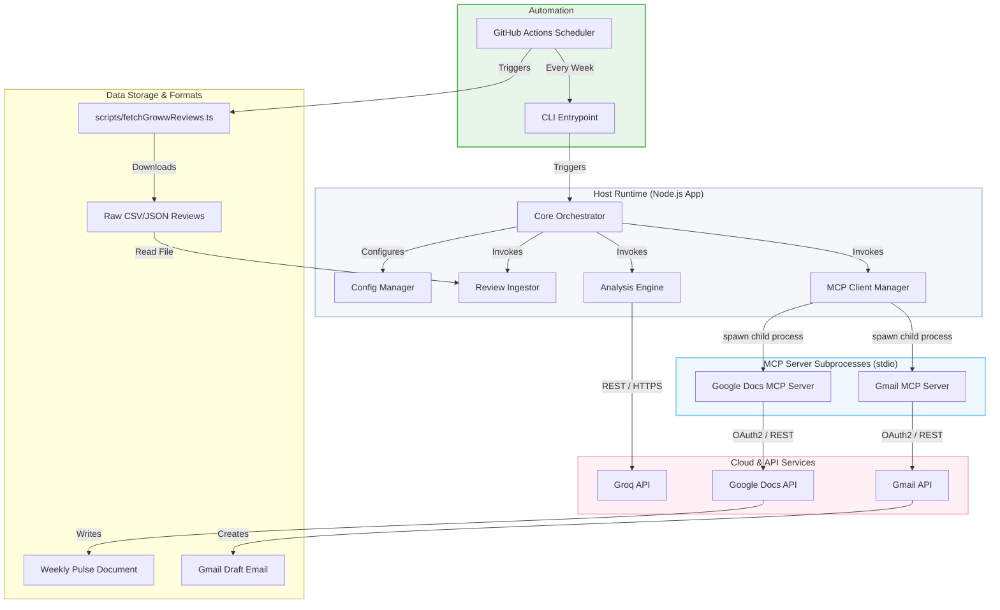
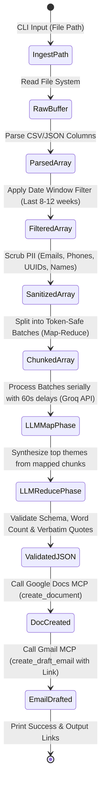
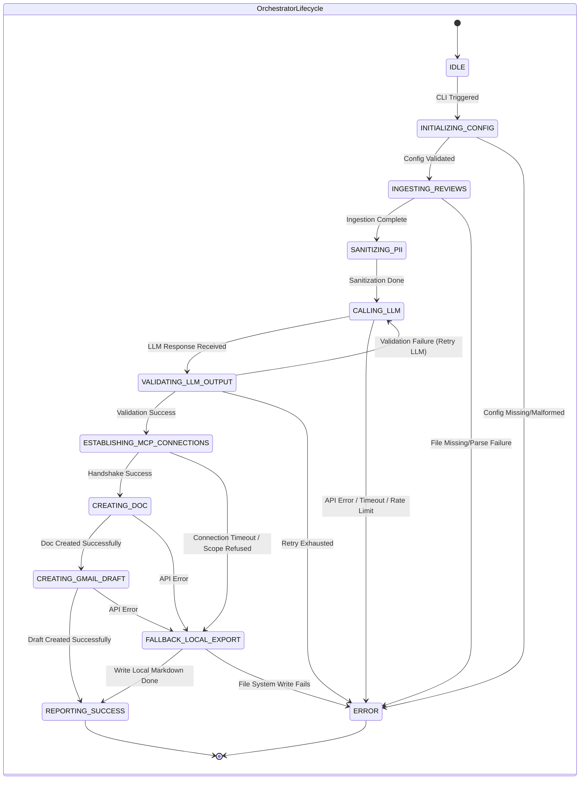
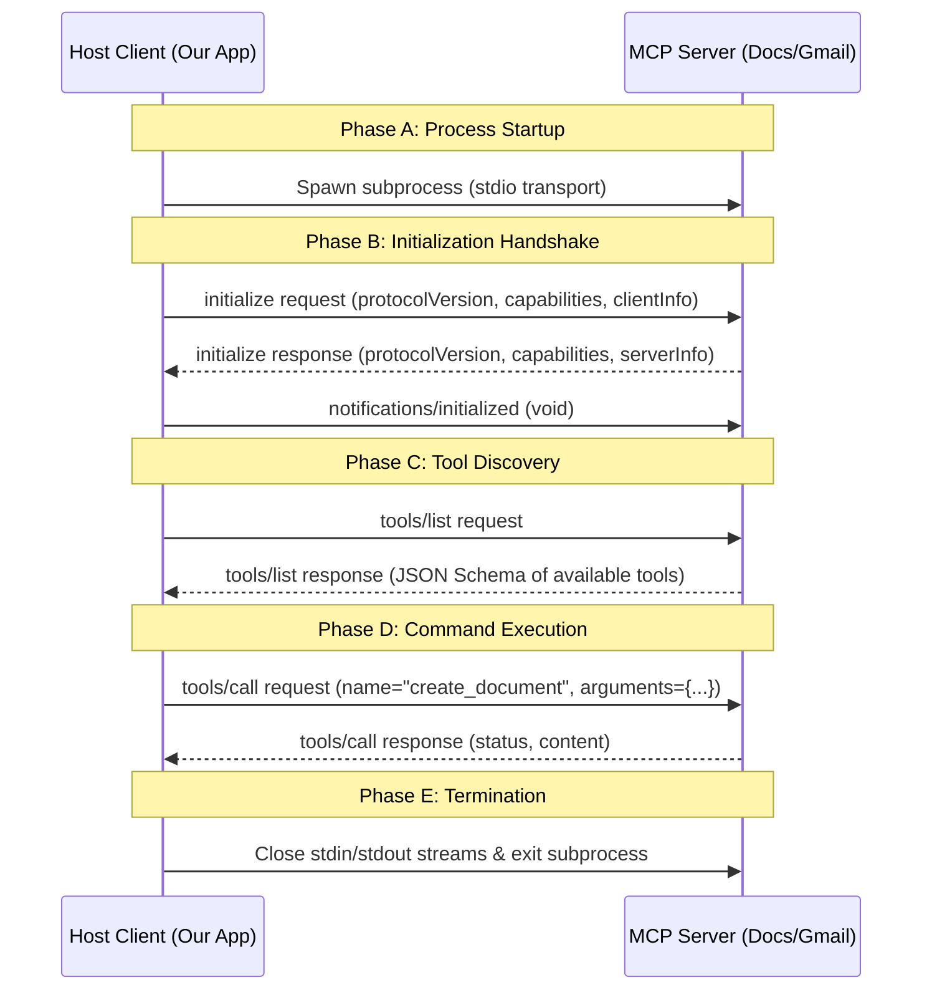
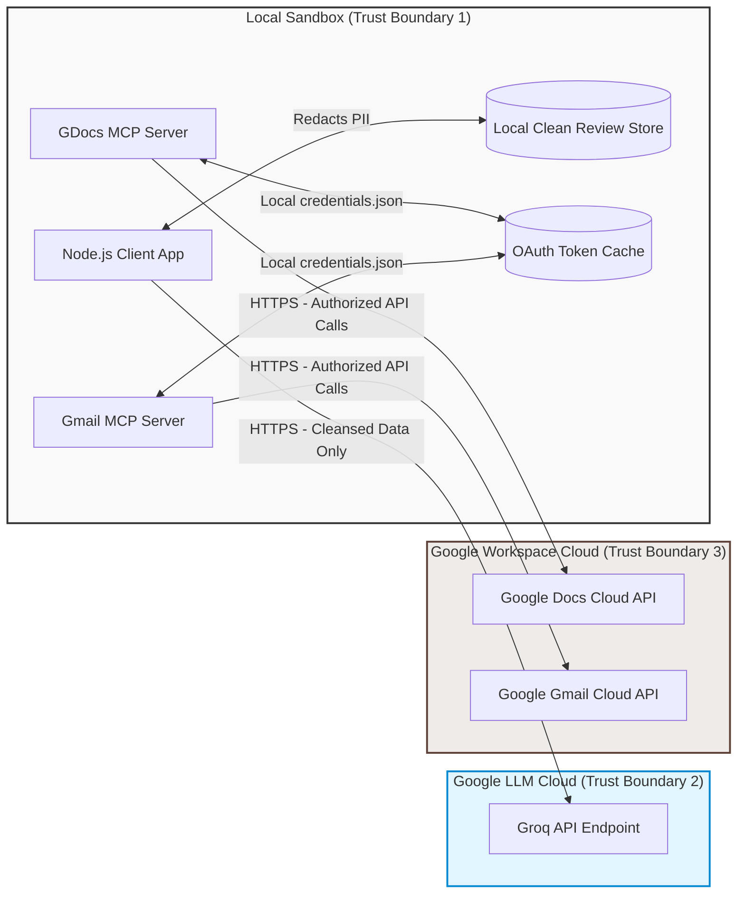

# App Review Insights Analyser - Architecture Design

This document details the system architecture, component breakdown, data pipeline, system states, and integration strategies for the **App Review Insights Analyser**.

---

## 1. System Topology & Core Architecture

The system utilizes a decoupled, client-server topology mediated by the **Model Context Protocol (MCP)**. The core application runs as an MCP Host (Client) that manages the lifecycle of stdio-based subprocesses running Google Workspace MCP servers.



---

## 2. Directory Layout & Module Decoupling

To ensure maintainability, testability, and clean separation of concerns, the project directory is structured as follows:

```text
App Review Insights Analyser/
├── docs/
│   ├── architecture.md             # High-level architecture and system design
│   ├── decision.md                 # Architectural Decision Records (ADRs)
│   ├── eval.md                     # Phase exit criteria & testing framework
│   ├── phase-wise-implementationplan.md # Phase-by-phase task breakdown
│   └── problem-statement.md        # Core requirements & background
├── src/
│   ├── index.ts                    # Application CLI and orchestration entrypoint
│   ├── config.ts                   # Environment variable validation and config resolution
│   ├── types.ts                    # Shared TypeScript domain models & interfaces
│   ├── ingestor/
│   │   ├── index.ts                # Ingestion sub-system facade
│   │   ├── csvParser.ts            # CSV parsing and JSON format normalization
│   │   └── piiSanitizer.ts         # RegEx-based local PII scrubbing pipeline
│   ├── analyzer/
│   │   ├── index.ts                # LLM execution and verification facade
│   │   ├── groqClient.ts           # Groq SDK instantiation and response schema enforcement
│   │   └── prompts.ts              # System prompts, user prompts, and Zod schemas
│   └── mcp/
│       ├── index.ts                # MCP connection and command mapping facade
│       ├── mcpClient.ts            # Lifecycle manager for stdio MCP connections
│       └── workspaceTools.ts       # Orchestrator mapping CLI outputs to target tools
├── tests/
│   ├── csvParser.test.ts           # Ingestion and date filtering test suite
│   ├── piiSanitizer.test.ts        # PII regex validation test suite
│   └── analyzer.test.ts            # LLM output validation and quote matching tests
├── .env.example                    # Environmental configuration template
├── package.json                    # Dependencies, configurations, and build scripts
└── tsconfig.json                   # Compiler configuration for TypeScript compilation
```

---

## 3. Detailed Data Pipeline

Data flows through a series of transformations, starting from raw public review files to sanitized, structured data, and finally to external document edits. Each phase acts as a pure pipeline stage:



### Data Pipeline Transformations
1. **Raw Review Data**: Unstructured reviews downloaded directly from the app store via scraper scripts, stored locally as CSV or JSON (e.g. `sample_reviews.csv`).
2. **Parsed Reviews**: Standardized Javascript objects with typed attributes: rating (number), title (string), text (string), date (Date), and appVersion (optional string).
3. **Text Normalization Filters**: Reviews are strictly filtered to discard non-English text, reviews containing emojis, and reviews containing fewer than 6 words.
4. **Date-Filtered Reviews**: Array containing reviews whose dates fall strictly within the $8$ to $12$ week window (measured from the current system runtime time). The remaining clean reviews can also be exported to `clean_reviews.csv` and `clean_reviews.json` for validation.
4. **Sanitized Reviews**: Identical structure to parsed reviews, but with the body text and title text scrubbed of email addresses, telephone numbers, and UUIDs. The author fields and username patterns are masked as `[User]`.
5. **Map-Reduce Token Batching**: To process up to 1000 reviews without hitting Groq limits (12K Tokens per Minute, 30 Requests per Minute), the array is chunked into token-safe batches (~250 reviews each). These are sent serially to Groq with 60-second delay buffers to extract initial themes.
6. **LLM Output Synthesis (JSON)**: A final reduce call merges the mapped themes into a single structured payload containing the top 3 clustered themes, verbatim quotes, and actionable recommendations.
7. **Delivery Output**: A formatted document text in Google Docs and a drafted email message containing the document's link.

---

## 4. System State Machine & Lifecycle

The main orchestrator CLI runs as a single-pass execution. The lifecycle transitions through the following states, handling failures at each node:



---

## 5. Model Context Protocol (MCP) Client-Server Architecture

The Model Context Protocol establishes a clear boundary between client logic and workspace integrations. The application initializes child processes for each MCP server via `stdio` communication pipes (`stdin`/`stdout`).

### Subprocess Lifecycle Management
1. **Spawn**: The application reads command-line strings and arguments from environment variables and spawns the target servers as Node subprocesses.
2. **Communication**: Subprocesses communicate using line-delimited JSON-RPC 2.0 messages over standard input and standard output streams.
3. **Log Routing**: The host client intercepts `stderr` from the server subprocess and redirects it to the host application's log files. This prevents server-specific logging from polluting the JSON-RPC interface on `stdout`.
4. **Shutdown**: Once operations are completed, the host sends clean disconnect notifications and terminates the child processes.

### Protocol Handshake Details



---

## 6. Security, Isolation & Trust Boundaries

The system architecture divides trust and data handling into distinct boundaries to protect user accounts and data privacy:

* **Local Trust Boundary**: The Node.js application and the local MCP servers share standard system storage and access privileges. PII redaction happens strictly within this boundary before any network transmission occurs.
* **LLM Boundary**: Cleansed reviews are sent to Groq via HTTPS. Because PII is redacted locally, the LLM boundary never processes email addresses, phone numbers, or user IDs.
* **Workspace Boundary**: The local MCP servers communicate directly with Google Workspace using OAuth2 credentials stored on the developer's local machine. The core Node.js application has no direct access to these API keys or credential files, isolating credentials from code files.


