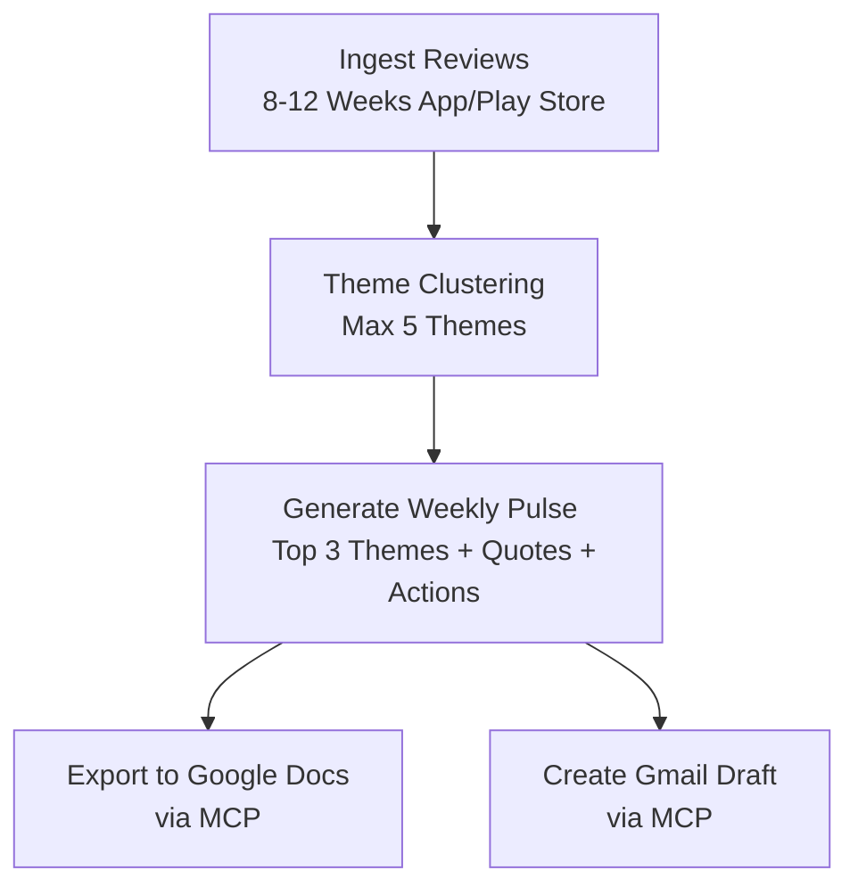

# App Review Insights Analyser - Problem Statement

## Problem Context & Background

Mobile applications on the Apple App Store and Google Play Store receive hundreds or thousands of user reviews daily. This public feedback is a goldmine of insights, highlighting bugs, usability hurdles, and feature requests. However, reading reviews individually is time-consuming and inefficient for cross-functional teams.

The **App Review Insights Analyser** addresses this challenge. The goal is to ingest raw app review data from the last 8–12 weeks, analyze it, group the feedback into structured themes, and output a concise, actionable **Weekly Pulse**. This pulse must then be published directly to the team's collaborative workspaces—Google Docs for documentation and Gmail for communication—using standard integration protocols.

---

## Target Audience & Personas

| Role | Pain Point | How this Tool Helps |
| :--- | :--- | :--- |
| **Product & Growth Managers** | Sifting through noise to prioritize roadmap features and bug fixes. | Highlights the top themes and provides concrete action ideas. |
| **Customer Support Teams** | Addressing user pain points without unified messaging. | Aligns support responses with what real users are saying. |
| **Leadership / Executives** | Lack of a quick health check of user sentiment. | Delivers a scannable, one-page weekly summary. |

---

## End-to-End Workflow



1. **Ingest**: Import public reviews from the last 8–12 weeks containing data points such as rating, title, content text, and date.
2. **Analyze**: Categorize/cluster the reviews into up to 5 main product themes (e.g., onboarding, authentication, payments, performance, UI/UX).
3. **Summarize**: Generate a scannable, one-page "Weekly Pulse" summary (≤250 words) detailing:
   - The top 3 themes based on review frequency/impact.
   - Real, verbatim user quotes representing each theme (anonymized, stripped of PII).
   - Three actionable next steps/ideas directly derived from the themes.
4. **Deliver**: Place the Weekly Pulse document in Google Docs and automatically draft a Gmail notification email containing or referencing the document.

---

## Integration Architecture: MCP Servers vs. Direct APIs

A key requirement of this project is the integration with Google Workspace (Google Docs and Gmail). We must use the **Model Context Protocol (MCP)** rather than writing custom API integration code.

### The Traditional Approach: Direct REST APIs (Anti-Pattern)
In standard application development, integrating Google Workspace typically involves:
* Registering a developer project in the Google Cloud Console.
* Configuring OAuth 2.0 consent screens and managing credentials (`client_secret.json`).
* Writing custom token lifecycle management code (token storage, token refreshing).
* Installing and configuration of heavy SDKs (e.g., `googleapis` or `google-api-python-client`).
* Hand-crafting HTTP/REST requests to endpoints like `https://docs.googleapis.com/v1/documents`.

This approach adds substantial boilerplate, increases security risks (associated with storing/refreshing user tokens in custom DBs), and creates maintenance overhead.

### The Modern Approach: Model Context Protocol (MCP) (Required)
The Model Context Protocol (MCP) abstracts the underlying integration complexity away from the application code. Under this architecture:
* **Decoupled Auth & Plumbing**: The application/agent communicates with a local or remote **MCP Server** configured for Google Docs and Gmail. The server manages credentials and handles API transport details internally.
* **Standardized Tooling**: The MCP server exposes high-level, standardized "Tools" (e.g., `create_document`, `append_text`, `create_draft_email`) through a unified JSON-RPC interface.
* **Agent-Friendly**: AI models and host applications can inspect the capabilities of the MCP server dynamically and execute tasks by calling tools, removing the need for developer-written REST clients.

```mermaid
graph TD
    subgraph Direct API Approach (Anti-Pattern)
        App1[Application Logic] -->|Bespoke OAuth & Credentials| Auth[OAuth Manager]
        App1 -->|Direct REST API Calls| GoogleAPIs[Google Docs & Gmail APIs]
    end

    subgraph MCP Server Approach (Required Architecture)
        App2[Application / AI Agent] -->|JSON-RPC Tool Calls| MCPhost[MCP Host]
        MCPhost -->|Standardized Interface| MCPserver[Google Docs & Gmail MCP Servers]
        MCPserver -->|Internal Handshake & Auth| GoogleAPIs2[Google Workspace Services]
    end
```

By leveraging MCP, our codebase remains clean and focused solely on review analysis and presentation logic, letting standard, reusable server connectors handle the authentication and service interactions.

---

## Key Constraints

* **Public Data Only**: Import reviews using public exports. No scraping or crawling behind user authentication screens that violates App Store or Google Play terms of service.
* **Theme Limits**: Restrict clustering to a maximum of 5 overall themes, showcasing only the top 3 in the written pulse.
* **Scannability**: Ensure the weekly note is highly scannable and fits on a single page (under 250 words for the core content).
* **Privacy & PII**: Absolutely no Personally Identifiable Information (PII)—usernames, email addresses, device IDs, or specific names—may be stored or included in the final Google Doc or Gmail draft. All quotes must be stripped of identifying details.
